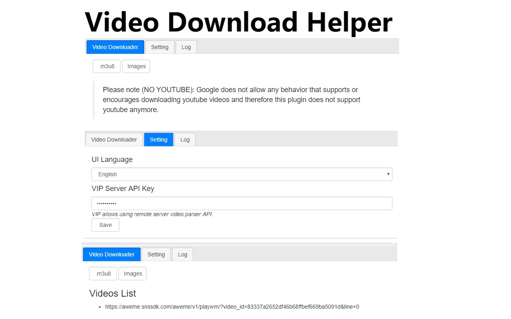

# Simple Video Download Helper

[](https://github.com/DoctorLai/VideoDownloadHelper/actions/workflows/ci.yml)
[](LICENSE)
[](https://nodejs.org/)
[](video-url-parser/manifest.json)
[](#contributing)

A lightweight browser extension that helps you find and download videos from a number of supported
websites. Built and maintained by [@justyy](https://justyy.com/).

> **Note:** By Chrome Web Store policy, the published build does **not** support YouTube or adult
> websites. You can still build the unpacked version yourself from this repository.



## Table of Contents

- [Features](#features)
- [Supported sites](#supported-sites)
- [Installation](#installation)
- [Project structure](#project-structure)
- [Development](#development)
- [Available scripts](#available-scripts)
- [Testing & coverage](#testing--coverage)
- [Linting & formatting](#linting--formatting)
- [Contributing](#contributing)
- [License](#license)
- [Links](#links)
- [中文说明](#中文说明)

## Features

- One-click detection of downloadable video URLs on the current page.
- Site-specific parsers plus generic fallbacks (`og:video` meta tags, `<video>` tags, and embedded
  `video_url` / `mp4` references).
- Zero runtime dependencies — the parser is plain, dependency-free JavaScript.
- Built on Chrome Extension **Manifest V3**.

## Supported sites

The parser ships with dedicated handlers for the following sites, and falls back to generic
extraction strategies for everything else:

| Site            | Example URL                                          |
| --------------- | ---------------------------------------------------- |
| miaopai.com     | `http://www.miaopai.com/show/<id>.html`              |
| pearvideo.com   | `http://www.pearvideo.com/video_<id>`                |
| ted.com         | `https://www.ted.com/talks/<talk>`                   |
| msdn.com        | `https://channel9.msdn.com/Events/.../<id>`          |
| weibo.com       | `https://www.weibo.com/<uid>/<id>`                   |
| xiaokaxiu.com   | `https://v.xiaokaxiu.com/v/<id>.html`                |
| facebook.com    | `https://www.facebook.com/<user>/videos/<id>/`       |

Generic fallbacks also recognise `og:video` headers, HTML `<video src>` tags, and embedded
`video_url` / `mp4` URLs.

See [tested URLs](video-url-parser/tested-urls.txt) for verified pages and
[the wishlist](video-url-parser/todo-urls.txt) for sites we would like to support next.

## Installation

### From the Chrome Web Store

Install the published (cut-down) version directly:
<https://chrome.google.com/webstore/detail/simple-video-download-hel/ilcdiicigjaccgipndigcenjieedjohj>

### Load the unpacked extension

1. Download a [release archive](https://github.com/DoctorLai/VideoDownloadHelper/releases) or build
   the bundle yourself (see [Development](#development)).
2. Open `chrome://extensions` and enable **Developer mode**.
3. Click **Load unpacked** and select the `video-url-parser/` folder.

### Firefox and other browsers

The extension should work on Firefox via
[Chrome Store Foxified](https://addons.mozilla.org/en-GB/firefox/addon/chrome-store-foxified/),
although it is not fully tested there.

## Project structure

```text
.
├── .github/workflows/ci.yml   # Continuous integration pipeline
├── LICENSE                    # MIT license
├── README.md
├── package.json               # Root scripts that delegate into video-url-parser/
└── video-url-parser/          # The extension itself
    ├── manifest.json          # Manifest V3 definition
    ├── js/
    │   ├── functions.js       # Core helper utilities (URL parsing, validation, ...)
    │   ├── constants.js       # Shared constants
    │   └── parsevideo.js      # The ParseVideo engine and site-specific parsers
    ├── test/                  # Mocha + Chai unit tests
    ├── eslint.config.js       # ESLint (flat config)
    ├── .prettierrc.json       # Prettier configuration
    ├── .nycrc.json            # Coverage configuration
    └── webpack.config.js      # Bundler configuration
```

## Development

Requirements: **Node.js >= 18**.

The extension and its tooling live in `video-url-parser/`. For convenience, the repository root
exposes the same npm scripts and delegates them into that directory, so you can work from **either**
location:

```bash
# From the repository root (delegates into video-url-parser/)
npm install

# ...or directly inside the extension directory
cd video-url-parser
npm install
```

Build the bundled content script into `dist/dist.min.js`:

```bash
npm run build      # production build
npm run dev        # development build
npm run watch      # rebuild on change
```

## Available scripts

The scripts below can be run from the repository root **or** from the `video-url-parser/` directory
(the root delegates to the sub-project).

| Script                  | Description                                          |
| ----------------------- | ---------------------------------------------------- |
| `npm test`              | Run the Mocha unit-test suite.                       |
| `npm run coverage`      | Run the tests and produce an Istanbul/nyc report.    |
| `npm run lint`          | Lint the source and tests with ESLint.               |
| `npm run lint:fix`      | Auto-fix lint problems where possible.               |
| `npm run format`        | Format the codebase with Prettier.                   |
| `npm run format:check`  | Verify formatting without writing changes.           |
| `npm run check`         | Run lint, format check and tests together.           |
| `npm run build`         | Produce the production bundle.                        |

## Testing & coverage

Unit tests use [Mocha](https://mochajs.org/) and [Chai](https://www.chaijs.com/):

```bash
npm test
```

Generate a coverage report (text + HTML + lcov) with [nyc](https://github.com/istanbuljs/nyc):

```bash
npm run coverage
```

The HTML report is written to `coverage/index.html` and the lcov report is uploaded to
[Codecov](https://codecov.io/) from CI. Coverage thresholds are enforced via `.nycrc.json`.

## Linting & formatting

Code quality is enforced with [ESLint](https://eslint.org/) (flat config) and
[Prettier](https://prettier.io/). Both run automatically in CI on every push and pull request, across
Node.js 18, 20 and 22.

```bash
npm run lint
npm run format:check
```

## Contributing

Contributions are welcome! Please:

1. [Open an issue](https://github.com/DoctorLai/VideoDownloadHelper/issues) to report a bug or
   request a feature.
2. Fork the repository and create a topic branch.
3. Ensure `npm run check` passes before opening a pull request.

## License

This project is licensed under the [MIT License](LICENSE).

## Links

- Web version: <https://weibomiaopai.com/download-video-parser.php>
- Author: [@justyy](https://justyy.com/) · [helloacm.com](https://helloacm.com)
- Blog post (Chinese): <https://justyy.com/archives/5615>

If this project helps you, consider supporting it:
[PayPal](https://justyy.com/out/paypal) ·
[Buy Me a Coffee](http://helloacm.com/out/buymecoffee)

## 中文说明

这是一个简易的浏览器视频下载助手扩展，帮助你从受支持的网站上查找并下载视频。

由于 Google 政策限制，发布到 Chrome 应用商店的版本**不支持** YouTube 以及一些成人网站。你仍然可以从本仓库自行构建并加载未打包（unpacked）的版本，或使用网页版：
<https://weibomiaopai.com/download-video-parser.php>

- Chrome 扩展下载地址：<https://chrome.google.com/webstore/detail/simple-video-download-hel/ilcdiicigjaccgipndigcenjieedjohj>
- 相关博文：<https://justyy.com/archives/5615>
- 如果这个小项目对你有帮助，欢迎支持：[PayPal](https://justyy.com/out/paypal) · [请我喝杯咖啡](http://helloacm.com/out/buymecoffee)
